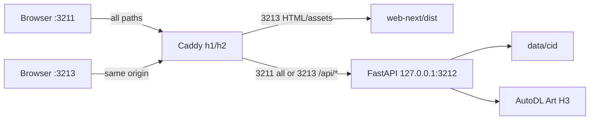
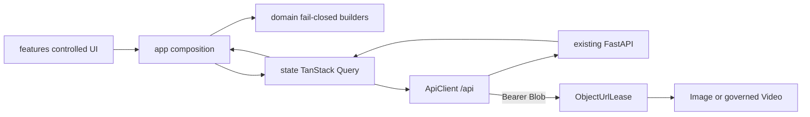

# Ant Design X 前端架构（How/Now）

## 状态与运行边界

当前候选分支已集成 `web-next`、双入口 Caddy 候选配置和自动化测试，但仓库实现不证明线上 3213 已生效。本架构在生产只读 smoke 完成前保持 `building`。

- 3211 保持整站反代到 uvicorn，由 `web/` 提供旧 UI。
- 3213 的 `/api/*` 保留路径并反代同一 `127.0.0.1:3212`；其余路径由同一 Caddy unit 从 `web-next/dist` 提供，未知客户端路由回落 `index.html`。
- 不新增 CORS、前端 service、第二个 uvicorn 或前端专用数据存储。3211/3213 是不同 origin，因此 `cvs_token` 和 Query session 独立。

## 模块

| 模块 | 职责 | 实现的 feature |
| --- | --- | --- |
| `src/main.tsx` | 创建唯一 runtime，把 QueryClient、XProvider/AntD App 和 App 组合到 React root | antd-x-frontend |
| `src/api/` | 相对 `/api` 的 JSON、XHR 上传和认证 Blob transport；401 清 session，submit 单飞 | antd-x-frontend |
| `src/state/` | TanStack Query keys、2 秒条件轮询、mutation invalidation、session 隔离、Object URL lease | antd-x-frontend |
| `src/domain/` | 纯函数校验 detail、服务端建议/冻结值、CAS 与 generation/recovery payload；无 React 和网络 | antd-x-frontend |
| `src/app/` | 把 API/state/domain 与页面组合；唯一拥有跨 feature 的工作流状态 | antd-x-frontend |
| `src/features/shell` | token 登录、桌面侧栏、移动 Drawer、会话导航 | antd-x-frontend |
| `src/features/create` | URL/文件、说明、台词处理和上传进度的受控创建器 | antd-x-frontend |
| `src/features/conversation` | 服务端状态驱动的 Bubble/空态/错误态 | antd-x-frontend |
| `src/features/media` | 提示词、摘要、视频、关键帧和长视频分段的纯展示 | antd-x-frontend |
| `src/features/generation` | 生成参数、冻结证据、付费任务数、分段进度和安全动作 | antd-x-frontend |
| `src/features/postprocess` | 选项 Modal、后台状态卡、冻结选项重试与结果预览 | antd-x-frontend |
| `src/ui/antd.ts` | AntD、Ant Design X、icons 和唯一 Video 的单一组件门面 | antd-x-frontend |
| `src/ui/theme.tsx` | 唯一 Token、中文 locale、XProvider、AntD App 与 QueryClientProvider 边界 | antd-x-frontend |
| `tests/app.spec.ts` | 真实 Chromium API 合同、付费安全、后台行为、移动端和截图基线 | antd-x-frontend |

## 数据流

关键不变量：

- API 返回是唯一业务状态源。组件不制造聊天回复、计时器、分段数、媒体参数或恢复能力。
- Query key 固定含 `sessionKey`；登录、退出和 401 都旋转 key，401/退出同时清空同一个 QueryClient。
- 已选中会话由页面 detail observer 在 queued/processing、generation queued/running、postprocess running 时按 2 秒轮询；列表中标记为后台运行且未选中的会话才挂载 background poller。`refetchIntervalInBackground=false` 只表示浏览器切到后台标签页时停止轮询。
- `read_only === false && submit_enabled === true` 才允许操作；缺字段即不可操作。
- prompt 保存使用 `expected_sha256`，长视频 submit 使用 `expected_plan_receipt`；冲突只刷新，不自动重发。
- 所有 TanStack mutation `retry=false`；会话 submit 另有 ApiClient 单飞门禁。
- 认证文件不直接放进 `/<video>` URL；Bearer fetch 得到 Blob 后租约化 Object URL，切换 key 或卸载即 revoke。

## 对外接口

- 浏览器入口：候选 `https://<host>:3213/`；SPA 不使用 React Router，当前页面选择保存在 App 内存。
- 后端入口：只使用同源相对 `/api`；完整清单见 [web-next reference](../reference/web-next.md)。
- 现有后端 schema、receipt 与付费状态机不变，见 [后端 reference](../reference/reference.md)。
- 发布与回滚只执行 [.deploy/runbook.md](../../../.deploy/runbook.md) 的 3213 合同；`vite dev/preview` 均不是生产入口。
