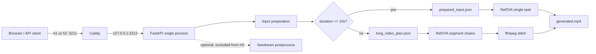
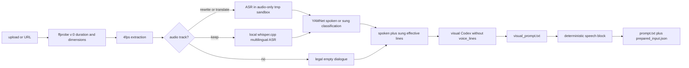
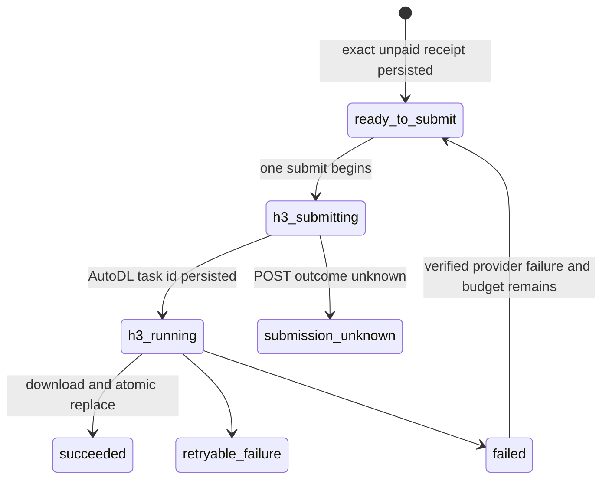

# 架构现状（How/Now）

## 运行边界

生产是单进程 uvicorn，文件系统同时承担会话存储、冻结输入和 H3 恢复日志。公网 Caddy 监听 `:3211`，仅反代到 `127.0.0.1:3212`；H3 是视频模型名，不是 HTTP/3。



## 模块

| 模块 | 职责 | 实现的 feature |
| --- | --- | --- |
| `app/main.py` | API、schema v2/只读门控、提交锁、异步 generation、启动恢复 | conversation-task |
| `app/storage.py` | 会话目录、meta、上传/探测、文件白名单 | conversation-task |
| `app/pipeline.py` | 4fps 抽帧、音频/台词准备、视觉 agent 隔离、初始 receipt | conversation-task |
| `app/prepared_input.py` | 结构化台词、唯一发声块、文件哈希绑定、fail-closed loader | conversation-task |
| `app/frame_fit.py` | 按真实 H3 输入推荐 `16:9/9:16`，并显式 crop/pad 为所选目标画幅 | conversation-task |
| `app/h3.py` | 直接 H3 的 prepare/submit/start/inspect/resume/retry 和磁盘状态机 | conversation-task |
| `app/long_video.py` | provider 整秒时长不超过 10 秒的安全分段、hard_cut/continue 链语义、canonical plan receipt | conversation-task |
| `app/long_generation.py` | 多图参考子任务冻结、默认最多两链调度、可选快速 fan-out、历史 boundary 恢复和拼接编排 | conversation-task |
| `app/stitch.py` | 24fps H.264 归一化、连续边界去重帧、源音频/静音拼接 | conversation-task |
| `app/asr.py` / `app/voice.py` / `app/vocal.py` | 本地多语种听写、ASR JSON 校验、YAMNet `spoken/sung` 分类 | conversation-task |
| `app/postprocess.py` / `app/seedream.py` | 可选去字幕/品牌关键帧编辑；不参与 H3 输入 | postprocess |
| `app/codex_runner.py` | 本地 codex 内层 workspace 沙箱、voice 专用外层文件系统隔离、并发和超时；不把服务凭据交给 agent | conversation-task |
| `web/` | 同源 UI、2 秒轮询、显式台词/画幅/清晰度/适配确认、冻结参数回显和人工重试 | conversation-task |

Seedance 生产提交模块已删除，`face_hold` 选项和机械提示词注入也已删除。旧实现不是部署回退面。

## 输入准备数据流



关键不变量：

- 新会话 `schema_version=2`，`duration_s` 只表示首个视频流 `v:0` 的正有限视觉时长且不超过 300 秒；优先 `stream.duration`，其次 `duration_ts*time_base`，最后扫描 `v:0` 包的 PTS 起止（末包缺 duration 时用相邻 PTS 或帧率补尾）。禁止用 OpenCV `frame_count/fps`、容器总时长或音轨时长覆盖它。`≤10s` 使用完整源视频的多图参考单请求；`>10s` 必须形成连续覆盖全片、provider 整秒时长不超过 10 秒的多图参考分段，不能回落到单请求。
- `keep` 模式由固定的本地 `whisper.cpp` multilingual small 处理 16kHz 单声道音频，自动检测语言；模型和二进制由部署固定，运行时不下载。`rewrite/translate` 才进入音频专用 Codex 隔离区。
- 自动台词的唯一可收养 agent 输出是隔离区 `work/voice_lines.json`：先做大小、普通文件与 JSON 字段白名单校验，再把净化结果写回主 `work/`。重试创建全新隔离区；Codex 超时/非零退出但完整产物已通过同一校验时仍可收养。
- 4fps 抽帧由 ffmpeg 按 `v:0` presentation timestamps 顺序批量解码；禁止用 OpenCV `CAP_PROP_POS_MSEC` 随机 seek 假设 CFR。ASR 初次校验和 YAMNet 分类使用 `voice.mp3` 的真实音频时长；这是独立于 `v:0` 的第二条时间轴。抽音以视频 `stream.start_time`（缺失才回落 packet PTS）为零点，用 `aresample first_pts=0` 让解码器先处理 AAC Skip Samples/Opus pre-skip，再按时间戳补前置静音或裁掉视频零点前音频，并在视觉终点裁剪/补静音。随后、写 `voice_lines/meta/receipt` 前，必须把有效台词归一到 manifest 的视觉时间轴。跨越视频结尾的行把 `end_s` 截到视频时长，`start_s >= duration_s` 的音频纯尾部行丢弃并留 provenance/warning，归一结果再过一次 voice 白名单。receipt 的时间真相始终是视觉时长。
- YAMNet 默认按句区间分类；仅当 ASR 只返回一句、该区间未命中而全轨单窗达到同一个 `51/256` 明确人声阈值时，允许按全轨较强的 `spoken/sung` 兜底。多句或纯 BGM 不使用该兜底。
- 视觉 agent 运行时看不到 `voice_lines.json`。视觉 prompt 中的 OCR、字幕、画面文字或备注不会被解析成台词。
- 视觉 agent 不携带具体目标秒数，只写“与源片段时长一致”；冻结 plan 边界和统一的六位小数归一后 `ceil` 是新请求时长的唯一真源。
- `auto` 只接受内部 ASR provenance；默认声学过滤同时保留 `spoken` 与 `sung`。短链可使用 `edit/custom`；长链创建只允许 `voice_mode=keep`，提交只允许复用源音频的 `auto` 或静音 `none`。
- `prompt.txt` 由视觉文本和唯一结构化发声块机械组合。无台词时明确禁止角色说出画面文字。
- ASR 输出中的 `[无法辨识]`、`[inaudible]`、`[unintelligible]` 等哨兵文本不是业务台词：净化为“本次未得到转写”，复用有声学人声证据时的一次重试；任何哨兵不得进入 `voice_lines.json`、prepared receipt 或 H3 prompt。
- 冻结的 H3 源提示词是唯一生成输入；项目不调用 MiniMax Context IR，也不接受运行时优化开关。
- `duration_s` 以 `v:0` 实际浮点时长写 receipt；上传、pipeline 重探测和提交门禁限制为 300 秒。短链和新长链都先把冻结边界归一到六位小数再 `ceil`，单次请求不超过 10 秒；历史 plan v1 保留原始浮点换算只为重建 11–15 秒的已有 boundary attempt，并禁止新 POST。最终 `keep` 拼接按源段帧预算精确裁补，以视频 presentation start 归零音频时间戳并保持全片时长。
- pipeline 首次进入 `processing` 与首次 submit 冻结输入共用同一个 per-CID 原子所有权 claim；检查 generation/receipt、取得所有权和写 meta 在同一把锁内完成。输家不得运行输入准备、改写 receipt 或触发 provider，完成/回滚也只能由当前 owner 提交。
- 生成推荐值与 pipeline `done` 原子落盘：短链使用实际选中的关键帧；长链使用 plan 中每个 `hard_cut` first anchor 与全部 end anchors，`continue` source first 不计。画幅在 `16:9/9:16` 中取总几何比例损失较小者，平局按源视频方向、仍平局取 `9:16`；清晰度按源视频短边与 `480/768` 的距离，平局取 `480p`。两种画幅都冻结 `fit_profiles`；所选目标完全匹配才用 `none`，否则默认 `crop` 并允许用户改为 `pad`。
- H3 关键帧来自原始 `work/keyframes/`，或在后处理 `done` 后来自完整的同名 `postprocessed/`；crop/pad 再由最终所选 bytes 派生到 `work/h3_frames/<aspect>/{crop|pad}/`。历史 boundary 长链按冻结 marker 使用旧布局，恢复不从后来新增字段猜输入。

## 冻结输入

`prepared_input.json` 的 schema 是 `duet.prepared-input` v1，与会话 schema v2 分开版本化。它绑定：

- source、可选 normalized audio、1–9 张有序关键帧、视觉 prompt、最终 prompt 的相对路径与 SHA-256；
- 台词 mode、标准化 lines、provenance、classification 和台词 JSON 哈希；
- `vocal_filter.enabled`、实际 `duration_s`、闭集 `ratio=16:9|9:16`、`fit_mode`；
- H3 的 workflow、整数时长、语义清晰度及唯一 provider 分辨率投影。

写 receipt 后立即经过同一 loader 复核；提交和重启恢复也重新加载。未知 schema/version、路径越界、文件缺失/漂移、台词或生成参数漂移、最终 prompt 不是确定性组合时全部 fail closed。提交锁内会按用户最终台词、画幅、清晰度和适配选择重写 receipt，随后 H3Request 只使用当次加载的不可变 bytes。`H3Request` 只持有语义值，`provider_resolution()` 唯一投影为 `480p横/480p竖/768p横/768p竖`；input manifest、attempt receipt 和 provider body 必须一致。

长链不用短链 receipt 冒充多段输入。新 `long_video_plan.json`（`duet.long-video-plan` v2，v1 仅用于历史恢复）绑定完整源文件、总时长、多图参考 workflow，以及每段的范围、chain/join、源片、关键帧、兼容锚点、视觉/最终提示词和台词摘要。detail 暴露该文件内容的 SHA-256 为 `plan_receipt`；提交必须原样回传 `expected_plan_receipt`。服务在任何供应商 POST 前重新校验 plan、meta 和所有文件哈希，并将确认值冻结到 `frozen_plan_receipt`。

历史长会话若 `fit_required=null` 且尚未冻结提交，detail 与 submit 从通过路径和哈希校验的 plan anchors 纯派生，不由 GET 改写 meta；不完整或越界 plan 返回未知并在付费前拒绝。plan、prompt 与 anchors 都以单次读取的 SHA-bound bytes 快照完成解析、比例判断、画幅派生和 H3 请求构造，路径随后变化不能替换已验证的付费输入。若会话已有 generation/frozen receipt，则以已冻结 `fit_mode` 投影有效值，保持 active、failed 和 resume 请求的原 CAS，不重写输入。

新长链的每个 segment 都使用本段 1–9 张冻结参考图；`continue/hard_cut` 只控制调度、连续性提示词和拼接边界，不再把参考图替换成首尾帧。历史已创建的 boundary attempt 仍使用原首尾帧 receipt 恢复，绝不用新模式重发。

`postprocess` 不存在表示用户跳过优化，使用原关键帧；一旦存在则提交必须等待 `done`，并逐一解析同名 `postprocessed/`。所选优化 bytes 经画幅处理后写入短链 prepared-input receipt 或长链分段 H3 input receipt；文件缺失、列表不全或生成已开始后再请求优化均拒绝。

## H3 付费状态机



`app/h3.py` 先以 `ready_to_submit` 持久化 exact unpaid input receipt；单次 `submit` 在供应商 POST 前改写为 `h3_submitting`，拿到 task id 后再持久化 task receipt，最后才允许 GET 轮询。`.h3/` 的安全边界：

- `session.json` 绑定 cid；`session.lock` 使用非阻塞 flock，拒绝同会话并发推进。
- `attempts/000001/attempt.json` 以 0600 创建，后续原子写 + `fsync`；attempt state schema 为 v1。
- input、H3 task 和最终输出各有 receipt；状态中不保存结果 URL或凭据，只保存安全错误码。
- `start` 以同一 client id 幂等推进；公开 `resume_required` 由用户用同 id、同台词、同画幅、同清晰度和同 fit 确认后再次调用 `start`，继续同一 receipt/attempt。普通确定 `failed` 仍由新 id 调 `retry` 创建 attempt。
- 启动 `resume` 默认只对已经持久化的 task 做 GET 查询/下载。唯一自动新 POST 例外要求上一 attempt 精确为 `failed + h3_provider_failed + h3.failed`，并有 task id、task receipt、受净化 provider 诊断、相同 input receipt 和剩余额度；它等待固定间隔后沿用同 client id 创建下一顺序 attempt。失败后已原子落盘的 `ready_to_submit/h3.ready` 自动 attempt 可由 `resume` 提交一次；无 task id 的 `submitting` 仍锁为 `submission_unknown`。
- provider 成片 URL 必须是无 userinfo 的 HTTPS，且 DNS/IP 预解析结果全部为公网地址。下载 client 不读取代理环境；响应到达后在读取 status/body 前，从 httpx network stream 取得实际 socket peer 并再次要求公网地址，从而不把预解析结果当作连接事实。无法解析 DNS、无法验证 peer、ffprobe 缺失/超时属于已有 task 的可恢复故障；预解析或实际 peer 为私网则确定拒绝。
- 下载不跟随重定向。Content-Length 和实际流都限制为 200 MiB，内容先写同目录 0600 临时文件；ffprobe 正常执行并确认 `v:0` 的 `duration` 或 `duration_ts*time_base` 正有限后，才原子替换 `generated.mp4` 并 fsync；音频或容器时长不能让无有效视觉时间轴的文件通过。

API 暴露的 coarse generation 是 `queued/running/resume_required/succeeded/failed/submission_unknown`。四类 provider 查询/超时及 `download_failed/download_dns_failed/download_peer_unverified/output_write_failed/output_probe_failed` 映射为 `resume_required`；URL/实际 peer、重定向、体积、无效视频等确定性安全拒绝映射为 `failed`。只有完整确认的 `h3_provider_failed` 会在额度内自动新建 attempt；`h3_submit_rejected`、结果缺失、输入/安全错误和 `submission_unknown` 都不会。`submission_unknown` 对任何 id 固定返回 409 `submission_outcome_unknown`。

长链在 `generation.fast_mode` 冻结调度语义；字段缺失精确解释为 `false`。当前 Web 的新长链 draft 固定为 `true`，确认页不渲染模式开关或说明，生成结果参数摘要也不展示该模式；这只是入口策略，后端仍接受 `false` 并按 generation 冻结值恢复或重试。`generation.segments` 保存每段 `index/chain_id/join_mode/status/attempt/error/child_request_id`，公开接口省略 `child_request_id`。默认模式同链严格串行、不同链最多两个并发，`continue` 使用上游真实成片尾帧；provider 自动补交成功后才推进同链下游。快速模式先构造全部不可变请求并通过 unpaid `h3.prepare` 落盘全部 input receipt，任一本地预检失败都不会产生供应商 POST；随后有界并发 `h3.submit`，每个 worker 只跨越一次 POST 边界，不等待生成完成，最后有界并行 `h3.resume`。快速 `continue` 的 first frame 是上一 `FrozenSegment.last_frame` 已 receipt 绑定、按同一 fit 处理的原 bytes，不读取 `generated.mp4/generated_last.png`。快速模式只自动补交精确失败 child，成功兄弟独立复用；未知段锁住整批且绝不二次 POST，但已知兄弟任务仍继续 GET 并保存结果。启动恢复默认 GET-only，并额外接管含精确 `h3_provider_failed` 子段的失败 root；已 prepare 未 POST 的普通 child 保持 queued 等待用户同 id 确认。全部成功后沿用同一 stitch、源音轨和时长/SHA 验收。

## 数据布局

```text
data/<cid>/
├── meta.json                         # conversation schema v2
├── source.<mp4|mov|webm>
├── prepared_input.json               # short only: duet.prepared-input v1
├── long_video_plan.json              # long only: duet.long-video-plan v2 (v1 recovery)
├── generated.mp4                     # H3 success only
├── .h3/                               # short-video attempt state
│   ├── session.json
│   ├── session.lock
│   └── attempts/000001/attempt.json
└── work/
    ├── manifest.json
    ├── voice.mp3                     # optional
    ├── voice_lines.json
    ├── visual_prompt.txt
    ├── prompt.txt
    ├── keyframes/*.png
    ├── h3_frames/<aspect>/{crop|pad}/*.png # short only, after explicit fit choice
    ├── postprocessed/*.png           # optional display-only Seedream output
    └── segments/<N>/
        ├── source.mp4
        ├── generated.mp4             # paid reference segment output
        ├── .h3/attempts/...           # segment-owned provider state
        └── work/
            ├── anchors/{first,last}.png
            ├── keyframes/*.png
            ├── h3_frames/...         # fitted anchors when required
            ├── visual_prompt.txt
            └── prompt.txt
```

旧 meta 缺 `schema_version=2` 时，详情派生 `read_only=true`；文件仍可查看，但 `/submit` 和 `/postprocess` 都拒绝修改。

## 并发、恢复与安全

- 上传创建的查重/排队计数在进程锁内；pipeline 使用进程信号量；提交和后处理各有每会话 asyncio 锁。长视频提示词准备最多使用一半 Codex 并发槽，生成最多推进两条独立 chain。
- H3 远程调用在后台线程中执行，状态先写 meta `queued`，再写 `running`。服务启动仅扫描 schema v2 且 generation 为 `queued/running` 的会话。
- 应用必须单进程运行。内存锁和信号量不跨 worker；不要加 `--workers`。
- 供应商凭据只在 `Settings`/H3Request 内存中；receipt、attempt、meta、API 与安全错误都不含密钥。
- 自动台词依赖宿主 `bwrap` 与 Codex 内层 sandbox 能力；任一不可用都令该准备步骤失败，不退化为仅靠提示词禁止读取视觉输入。
- Caddy 是唯一公网监听；uvicorn 固定 `127.0.0.1:3212`。systemd 使用 0077 umask 和外部 0600 EnvironmentFile。

## 对外接口

- HTTP：`/api/health`、`/api/login`、`/api/conversations*`；完整字段和状态码见 [reference](../reference/reference.md)。
- Python：短链使用 `prepared_input.write_prepared_input/load_prepared_input`；长链使用 `long_video.plan_segments/write_plan_receipt`、`long_generation.freeze_plan/run` 和 `stitch.stitch_video`；默认链复用 `h3.start/inspect/resume/retry`，快速链另用 `h3.prepare/submit/resume`，两者共用 `frame_fit.fit_frames`。
- 部署：[.deploy/runbook.md](../../../.deploy/runbook.md)；systemd 示例不包含凭据。
