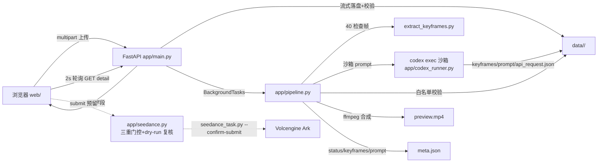

# 架构现状（How/Now）

单进程 uvicorn（0.0.0.0:3211）跑 FastAPI，同源挂静态前端；上传即建 `data/<cid>/` 目录，后台任务串行跑「抽帧 → codex 沙箱 → 白名单校验 → ffmpeg 预览」，状态落 `meta.json`，前端 2s 轮询。无数据库、无队列——文件系统即存储，内存即任务态。

## 模块

| 模块 | 职责 | 实现的 feature |
| ---- | -------- | -------------- |
| `app/main.py` | 全部路由、每 IP 上传限流（10 次/分，滑动窗口）、StaticFiles 挂 `web/` | conversation-task |
| `app/config.py` | `Settings` dataclass + `get_settings()` 读环境变量 | conversation-task |
| `app/auth.py` | Bearer 口令校验（`hmac.compare_digest`） | conversation-task |
| `app/storage.py` | 会话目录/元数据读写、上传流式落盘、ffprobe 探测、files 白名单解析 | conversation-task |
| `app/pipeline.py` | 处理流水线编排 + agent 产物白名单校验 + 预览合成 | conversation-task |
| `app/codex_runner.py` | 沙箱化 `codex exec` 调用（argv、断网、env 清洗、超时、并发信号量） | conversation-task |
| `app/seedance.py` | 预留的 Seedance 真实提交：三重门控 + dry-run 复核 + 脱敏 | conversation-task |
| `web/` | 原生 JS 单页前端（登录/会话列表/上传/轮询/结果展示），无构建 | conversation-task |
| `skills/seedance-cleaning-video-maker/` | codex agent 用的技能：`scripts/extract_keyframes.py`、`scripts/seedance_task.py` + 参考文档 | conversation-task |

## 数据流



## 状态机

`queued → processing → done | failed`

- `queued`：创建即得（`storage.new_conversation`）。
- `processing`：后台任务入口置位（`pipeline.run` 第一步）。
- `done`：产物校验过 + 预览合成完，写入 `keyframes`/`prompt`。
- `failed`：任一步异常，写 `error`（截断 ≤500 字）；不抛回 HTTP 层。
- 终态后另有提交标记：`mark_submitted` 写 `has_video/submitted_at/task_id`（meta 内部字段，不进 API 响应）。
- 只前进不回退；无取消/重跑；进程重启后 `processing` 会话不自动续跑。

## 数据布局

```
data/<cid>/                     cid = uuid4 hex（32 位小写，目录名正则 ^[0-9a-f]{32}$）
├── meta.json                   会话元数据（见 reference 关键数据形）
├── source.<mp4|mov|webm>       原始上传（流式落盘）
├── preview.mp4                 15s 720x1280(9:16) 25fps libx264 无声占位预览
├── generated.mp4               真实提交成功后下载的成片（仅 submit 开启后）
└── work/
    ├── contact_sheet.jpg       40 帧等距检查拼图（pipeline 预生成）
    ├── manifest.json           视频元数据 + 40 帧时间戳
    ├── NN_inspect_*.png        40 张检查帧
    ├── codex_last_message.txt  codex -o 落盘的最终消息
    ├── keyframes/              keyframe*.png（1..9 张，白名单校验后采信）+ 脚本自产的 contact_sheet.jpg/manifest.json
    ├── shot_timeline.md        agent 写的镜头时间线（必需，缺失即 failed）
    ├── seedance_prompt.txt     agent 写的中文 prompt（非空、≤32KB）
    ├── api_request.json        dry-run 落盘的评审 payload（提交时复核基准）
    ├── recheck_payload.json    提交复核的瞬时产物（用完即删）
    └── task.json               提交后脚本自写的任务状态（task_id 来源）
```

## 安全模型

公网暴露 + 单口令，防线自外向内：

1. **传输入口**：`/api/conversations*` 全部要 `Authorization: Bearer`，`hmac.compare_digest` 比较；`/api/login` 同样比较后只回 `{"ok":true}`（口令由前端存 localStorage）。上传限流 10 次/分/IP（内存滑动窗口）。
2. **上传校验链**：扩展名白名单 → 流式落盘限大小（超限即删）→ ffprobe 实探（打不开/时长超限即 422）→ 失败整体回滚目录。详见 reference。
3. **不信任 agent 输出**：codex 产物经 `validate_work_dir` 白名单校验才采信（关键帧数量、prompt 大小、api_request.json 结构、递归扫密钥字段名）；meta 提交标记不回 API。
4. **files 白名单**：`resolve_file` 只映射 `preview.mp4`/`generated.mp4`/`contact_sheet.jpg`/`keyframes/<fn>`，resolved-path 防穿越。
5. **codex 沙箱**：argv 逐项见下表；永不 `shell=True`，永不 `--dangerously-bypass-*`；硬超时 `CODEX_TIMEOUT_S`；并发信号量 `CODEX_CONCURRENCY`。
6. **密钥红线**：`ACCESS_TOKEN`/`ARK_API_KEY` 只存在于服务进程环境；不进日志/响应/meta.json；seedance 报错一律 `_sanitize` 脱敏（删含 key|authorization 行 + 抹除密钥字面值）；pipeline/codex 报错先 `clean_stderr`（剔环境变量行，截 500 字）。

### codex 沙箱 argv 逐项（`CodexRunner.build_argv`，codex-cli 0.147.0 实证）

| argv 项 | 作用 |
| --- | --- |
| `codex exec` | 非交互执行，prompt 作位置参数 |
| `-C <data/<cid>>` | 工作区限定在该会话目录 |
| `-s workspace-write` | 沙箱可写工作区、其余只读 |
| `--skip-git-repo-check` | data/ 非 git 仓库，跳过检查 |
| `--ephemeral` | 不持久化会话 |
| `--color never` | 输出无 ANSI，便于 stderr 清洗 |
| `-o <workdir>/codex_last_message.txt` | agent 最终消息落盘 |
| `-c sandbox_workspace_write.network_access=false` | agent shell 断网（实证 curl 不通） |
| `-c shell_environment_policy.inherit="core"` | 只继承核心环境（`inherit="none"` 实证会让沙箱启动器找不到 bwrap，不可用） |
| `-c shell_environment_policy.exclude=["*KEY*","*TOKEN*","*SECRET*","*PASSWORD*"]` | 配置级剔除秘密变量（兜底） |

### 环境清洗双保险及原因

- **宿主进程级（必需）**：调起 codex 前 `_scrubbed_env()` 剔除名字匹配 `KEY|TOKEN|SECRET|PASSWORD`（忽略大小写）的环境变量，PATH/HOME/代理保留。原因：codex 0.147.0 的 shell 命令经 code-mode-host 执行，`shell_environment_policy` 的 inherit/exclude **拦不住**宿主秘密泄进 agent shell，必须在本进程侧清洗。
- **codex 配置级（兜底）**：上表后两条 `-c`。
- **推论（有意设计）**：env 清洗会杀掉 `OPENAI_API_KEY`/`CODEX_API_KEY` 类 env 认证，codex 只支持 CODEX_HOME 文件认证（HOME 保留，`~/.codex/auth.json` 可达）。
- prompt 同时硬性禁令：只在会话目录写文件、禁止联网、禁止打印/读取任何环境变量。

## 配置

环境变量（`app/config.py:get_settings()`；`HOST`/`PORT` 在 `run.sh`，`ARK_API_KEY` 在 `app/seedance.py` 直读）：

| 变量 | 默认 | 说明 |
| --- | --- | --- |
| `ACCESS_TOKEN` | 无（必填，缺则 RuntimeError） | 全站共享口令，Bearer 校验 |
| `MAX_UPLOAD_MB` | `500` | 上传大小上限 |
| `MAX_DURATION_S` | `300` | 视频时长上限（ffprobe 实探） |
| `ENABLE_SEEDANCE_SUBMIT` | 关 | `1/true/yes` 开启真实提交（否则 501） |
| `DATA_DIR` | `data` | 会话数据根目录 |
| `CODEX_TIMEOUT_S` | `600` | codex 硬超时 |
| `CODEX_CONCURRENCY` | `1` | codex 并发信号量（默认串行） |
| `ENABLE_PIPELINE` | 生产默认 `1` | 关掉则上传后不跑流水线（停 `queued`） |
| `HOST` / `PORT` | `0.0.0.0` / `3211` | run.sh 监听地址 |
| `ARK_API_KEY` | 无 | Seedance 密钥；submit 时缺则 503；只存服务进程环境 |

`ENABLE_PIPELINE` 的双默认是测试取向：`Settings` dataclass 字段默认 `False`（测试直建不跑流水线），`get_settings()` 环境默认 `"1"`（生产直跑）。

## 对外接口

- `GET /api/health`（无鉴权）；`POST /api/login`（口令交换）
- `GET/POST /api/conversations`，`GET /api/conversations/{cid}`，`GET /api/conversations/{cid}/files/{name}`，`POST /api/conversations/{cid}/submit`（均 Bearer）
- `/`：StaticFiles 挂 `web/`（html=True）
- 完整契约（字段/状态码/门控矩阵）见 `docs/agent/reference/reference.md`
