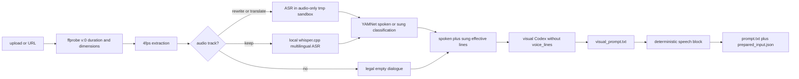
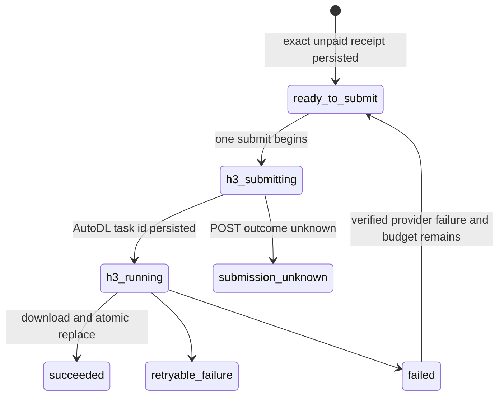

# 架构现状（How/Now）

## 运行边界

生产是单进程 uvicorn，文件系统同时承担会话存储、冻结输入和 H3 恢复日志。公网 Caddy 监听 `:3211`，仅反代到 `127.0.0.1:3212`；H3 是视频模型名，不是 HTTP/3。


## 模块

| 模块 | 职责 | 实现的 feature |
| --- | --- | --- |
| `app/main.py` | current v4 单 operation、A→B 自动续跑、提交所有权、异步 generation 与启动恢复 | conversation-task |
| `app/storage.py` | 会话目录、meta、上传/探测、文件白名单 | conversation-task |
| `app/pipeline.py` | 4fps 抽帧、音频/台词准备、视觉 agent 隔离、初始 receipt | conversation-task |
| `app/prepared_input.py` | 结构化台词、唯一发声块、文件哈希绑定、fail-closed loader | conversation-task |
| `app/frame_fit.py` | 按真实 H3 输入推荐 `16:9/9:16`，并显式 crop/pad 为所选目标画幅 | conversation-task |
| `app/h3.py` | 直接 H3 的 prepare/submit/start/inspect/resume/retry 和磁盘状态机 | conversation-task |
| `app/long_video.py` | provider 整秒时长不超过 14 秒的安全分段、hard_cut/continue 链语义、canonical plan receipt | conversation-task |
| `app/long_generation.py` | Fusion v2 装载、Ref2VA 确定性编译、exact-9 H3 子任务冻结、调度、恢复和拼接编排 | conversation-task |
| `app/context_ir_bridge.py` | current Ref2VA 同字节 local identity receipt；历史 provider receipt 只读恢复 | conversation-task |
| `app/stitch.py` | 24fps H.264 归一化、连续边界去重帧、H3 原生音频/同 EDL 静音拼接 | conversation-task |
| `app/asr.py` / `app/voice.py` / `app/vocal.py` | 本地多语种听写、ASR JSON 校验、YAMNet `spoken/sung` 分类 | conversation-task |
| `app/postprocess.py` / `app/mediakit.py` / `app/seedream.py` | 分段编排可选文字、图标擦除与图片优化，持久化付费 attempt；整段完成后才发布 H3 关键帧输入 | postprocess |
| `app/image_optimization.py` | 把 Skill 视觉语义确定性编译为 v4 逐帧 Seedream prompt；score/diagnostics 只供测试迭代 | postprocess |
| `app/codex_runner.py` | 本地 codex 内层 workspace 沙箱、voice 专用外层文件系统隔离、并发和超时；不把服务凭据交给 agent | conversation-task |
| `web/` | 同源 UI、2 秒轮询、显式台词/画幅/清晰度/适配确认、冻结参数回显和人工重试 | conversation-task |

Seedance 生产提交模块已删除，`face_hold` 选项和机械提示词注入也已删除。旧实现不是部署回退面。

### Current v4 与历史边界

current v4 在技术验收 A 后只公开一个 operation：未完成统一返回 `202 running`，receipt 绑定的成片有效后返回 `200 succeeded / commit_b`。Fusion、Ref2VA、Context、H3 和 stitch 都在同一个 CID 内自动继续；内部 refresh/CAS/error code 不是要求客户端刷新或二次提交的产品状态。

Fusion v2 只写逐 hard-cut 区间的 `visual[]`；后端独占 Ref2VA provider prompt 的编译权。Context 对这种 prompt 写 `local:identity:<sha256>` 同字节 receipt，HTTP 为 0。Fusion v1、旧 Context HTTP、source-audio multimodal、speaker visibility、quality verdict 和旧 short/long receipt 均为只读历史；已知付费 task 只按原 receipt GET 恢复，不进入 current create 或 fallback。

## 输入准备数据流



关键不变量：

- 新会话 `schema_version=2`，`duration_s` 只表示首个视频流 `v:0` 的正有限视觉时长且不超过 300 秒。current v4 总是形成 `segments[N>=1]`：`≤15s` 通常为 `N=1`，更长输入形成连续覆盖全片、provider 整秒时长不超过 14 秒的多个 segment。
- `keep` 模式由固定的本地 `whisper.cpp` multilingual small 处理 16kHz 单声道音频，自动检测语言；模型和二进制由部署固定，运行时不下载。`rewrite/translate` 才进入音频专用 Codex 隔离区。
- 自动台词的唯一可收养 agent 输出是隔离区 `work/voice_lines.json`：先做大小、普通文件与 JSON 字段白名单校验，再把净化结果写回主 `work/`。重试创建全新隔离区；Codex 超时/非零退出但完整产物已通过同一校验时仍可收养。
- 4fps 抽帧由 ffmpeg 按 `v:0` presentation timestamps 顺序批量解码；禁止用 OpenCV `CAP_PROP_POS_MSEC` 随机 seek 假设 CFR。ASR 初次校验和 YAMNet 分类使用 `voice.mp3` 的真实音频时长；这是独立于 `v:0` 的第二条时间轴。抽音以视频 `stream.start_time`（缺失才回落 packet PTS）为零点，用 `aresample first_pts=0` 让解码器先处理 AAC Skip Samples/Opus pre-skip，再按时间戳补前置静音或裁掉视频零点前音频，并在视觉终点裁剪/补静音。随后、写 `voice_lines/meta/receipt` 前，必须把有效台词归一到 manifest 的视觉时间轴。跨越视频结尾的行把 `end_s` 截到视频时长，`start_s >= duration_s` 的音频纯尾部行丢弃并留 provenance/warning，归一结果再过一次 voice 白名单。receipt 的时间真相始终是视觉时长。
- YAMNet 默认按句区间分类；仅当 ASR 只返回一句、该区间未命中而全轨单窗达到同一个 `51/256` 明确人声阈值时，允许按全轨较强的 `spoken/sung` 兜底。多句或纯 BGM 不使用该兜底。
- 视觉 agent 运行时看不到 `voice_lines.json`。视觉 prompt 中的 OCR、字幕、画面文字或备注不会被解析成台词。
- 视觉 agent 不携带具体目标秒数，只写“与源片段时长一致”；冻结 plan 边界和统一的六位小数归一后 `ceil` 是新请求时长的唯一真源。
- current `auto` 只把内部 ASR provenance 中的 `spoken` 投影为 Ref2VA 台词；`sung` 和 BGM 仅保留分析/诊断。current `auto|none` 都固定零 source audio reference；历史 short 的 `edit/custom` 与 source-audio 合同只读。
- current v4 不直接发送旧 `prompt.txt`。Fusion 只输出 visual prose，后端从 exact-9 Picture timeline、冻结 spoken 台词和 `music_policy=forbid` 编译唯一 Ref2VA prompt；无台词时明确不写 dialogue token。
- ASR 输出中的 `[无法辨识]`、`[inaudible]`、`[unintelligible]` 等哨兵文本不是业务台词：净化为“本次未得到转写”，复用有声学人声证据时的一次重试；任何哨兵不得进入 `voice_lines.json`、prepared receipt 或 H3 prompt。
- 后端编译的 Ref2VA prompt 是 current H3 唯一文本输入。Context 为同字节 local identity receipt，不调用 MiniMax Context HTTP，也没有运行时优化或备用 prompt 开关。
- `duration_s` 以 `v:0` 实际浮点时长写 receipt；current 每个 segment 请求不超过 14 秒。最终 EDL 按源段帧预算精确裁补：使用 H3 原生音轨或该段静音，不读取 source audio。历史 plan v1 只按原浮点和 receipt 恢复已知 task。
- pipeline 首次进入 `processing` 与首次 submit 冻结输入共用同一个 per-CID 原子所有权 claim；检查 generation/receipt、取得所有权和写 meta 在同一把锁内完成。输家不得运行输入准备、改写 receipt 或触发 provider，完成/回滚也只能由当前 owner 提交。
- 生成推荐值与 pipeline `done` 原子落盘，统一从全部 segment 的冻结图片/anchors 计算；`N=1` 不使用另一套分支。两种画幅都冻结 `fit_profiles`，最终 fit bytes 仍保持每段 exact-9。
- current v4 每段 H3 关键帧必须是 postprocess 技术验收后的 exact 9 张有序图片；crop/pad 由这些最终 bytes 派生。极短连续 scene 可以重复最近合法源帧并绑定 provenance，同 scene 相同 PTS 不破坏 exact-9。历史 boundary 布局只按冻结 marker 读取。

## 冻结输入

`prepared_input.json` 的 `duet.prepared-input` v1 是历史 short receipt，只读绑定：

- source、可选 normalized audio、1–9 张有序关键帧、视觉 prompt、最终 prompt 的相对路径与 SHA-256；
- 台词 mode、标准化 lines、provenance、classification 和台词 JSON 哈希；
- `vocal_filter.enabled`、实际 `duration_s`、闭集 `ratio=16:9|9:16`、`fit_mode`；
- H3 的 workflow、整数时长、语义清晰度及唯一 provider 分辨率投影。

写 receipt 后立即经过同一 loader 复核；提交和重启恢复也重新加载。未知 schema/version、路径越界、文件缺失/漂移、台词或生成参数漂移、最终 prompt 不是确定性组合时全部 fail closed。提交锁内会按用户最终台词、画幅、清晰度和适配选择重写 receipt，随后 H3Request 只使用当次加载的不可变 bytes。`H3Request` 只持有语义值，`provider_resolution()` 唯一投影为 `480p横/480p竖/768p横/768p竖`；input manifest、attempt receipt 和 provider body 必须一致。

current `long_video_plan.json` 是 `duet.long-video-plan` v5，绑定完整 source、总时长、segments、exact-9 scene timeline、Fusion production manifest、后端 Ref2VA prompt 和台词摘要。detail 暴露文件 SHA-256 为 `plan_receipt`；任何供应商 POST 前重新校验全部 bindings。v1-v4 只读。

历史长会话若 `fit_required=null` 且尚未冻结提交，detail 与 submit 从通过路径和哈希校验的 plan anchors 纯派生，不由 GET 改写 meta；不完整或越界 plan 返回未知并在付费前拒绝。plan、prompt 与 anchors 都以单次读取的 SHA-bound bytes 快照完成解析、比例判断、画幅派生和 H3 请求构造，路径随后变化不能替换已验证的付费输入。若会话已有 generation/frozen receipt，则以已冻结 `fit_mode` 投影有效值，保持 active、failed 和 resume 请求的原 CAS，不重写输入。

current v4 的每个 segment 都使用本段 exact 9 张冻结 Picture reference；`continue/hard_cut` 只控制冻结时间轴、Ref2VA Shot 编译和拼接边界。历史已创建的 1–9/boundary attempt 只按原 receipt 恢复，绝不用 current 模式重发。

`postprocess` 不存在表示用户跳过优化，使用原关键帧；一旦存在则提交必须等待 `done`，并逐一解析同名 `postprocessed/`。短视频统一作为逻辑段 `0`，长视频严格使用连续正整数 `1..N`。每段按已选阶段形成屏障：本段全部帧完成 MediaKit 文字擦除后才进入图标擦除，全部完成后才进入 Seedream；段之间并行，每个阶段的帧请求由供应商级信号量限流。

视觉关键帧冻结后，`skills/image-postprocess` current 只执行 `phase=plan`，以通用 stable keys 输出人物、持久实体、场景和逐帧可见状态的视觉语义。后端补齐 v4 实体 ID、所有权关系图及其他结构，冻结 source/scene/transition 与 SHA，再确定性生成逐帧 Seedream prompt；缺失语义使用 `source_preserve` 继续并记录 diagnostics。semantic compiler 的 `score/issues/ignored_mechanical_fields` 只写日志、测试断言和迭代分析，不参与生产控制流。旧 `_image_continuity` 和 quality-verdict receipt 只读，不升级。

每个 Seedream POST 前原子持久化绑定模型、模式、提示词摘要和输入摘要的 attempt。每个冻结帧请求硬上限一次 POST；`QuotaExceeded` 和其他确定拒绝直接终态失败，网络/超时/取消等 POST 结果不明都写为 `submission_unknown`。服务启动仅恢复能由本地产物证明安全的阶段；当前 revision 存在 submitting/unknown attempt 时将该段和整体标为失败，不自动重发。人工重试用 revision CAS 创建下一 revision，旧 attempt 不删除。

只有某段 exact 9 张输出全部完成时才以目录级原子替换发布 canonical `postprocessed/`。所选优化 bytes 经画幅处理后写入统一分段 H3 input receipt；文件缺失、列表不全、顺序或 SHA 漂移属于技术失败，不由旧图或质量 fallback 补位。

## H3 付费状态机



`app/h3.py` 先以 `ready_to_submit` 持久化 exact unpaid input receipt；单次 `submit` 在供应商 POST 前改写为 `h3_submitting`，拿到 task id 后再持久化 task receipt，最后才允许 GET 轮询。`.h3/` 的安全边界：

- `session.json` 绑定 cid；`session.lock` 使用非阻塞 flock，拒绝同会话并发推进。
- `attempts/000001/attempt.json` 以 0600 创建，后续原子写 + `fsync`；attempt state schema 为 v1。
- input、H3 task 和最终输出各有 receipt；状态中不保存结果 URL或凭据，只保存安全错误码。
- `start` 以同一 client id 幂等推进；公开 `resume_required` 由用户用同 id、同台词、同画幅、同清晰度和同 fit 确认后再次调用 `start`，继续同一 receipt/attempt。普通确定 `failed` 仍由新 id 调 `retry` 创建 attempt。
- 启动 `resume` 只对已经持久化的 task 做 GET 查询/下载，绝不创建或提交后续 attempt。`h3_provider_failed` 保持真实失败；历史自动创建但仍为 `ready_to_submit/h3.ready` 的后续 attempt 也不会由恢复器 POST。无 task id 的 `submitting` 锁为 `submission_unknown`。
- provider 成片 URL 必须是无 userinfo 的 HTTPS，且 DNS/IP 预解析结果全部为公网地址。下载 client 不读取代理环境；响应到达后在读取 status/body 前，从 httpx network stream 取得实际 socket peer 并再次要求公网地址，从而不把预解析结果当作连接事实。无法解析 DNS、无法验证 peer、ffprobe 缺失/超时属于已有 task 的可恢复故障；预解析或实际 peer 为私网则确定拒绝。
- 下载不跟随重定向。Content-Length 和实际流都限制为 200 MiB，内容先写同目录 0600 临时文件；原子替换前必须读取完整 packet/frame 时间轴并用 ffmpeg `-xerror` 解码完整视频和可选音频。视频唯一、音频至多一轨；每轨 DTS 与解码展示顺序不得回退，stream start/time base/duration、首尾 packet/frame PTS、视频 `avg/r_frame_rate` 均写入 `duet.h3.media_timeline` v1 receipt。音频存在时另写解码音频 SHA-256、采样率、声道及 A/V 展示首尾差，差值绝对值须不超过 100 ms；容器 `format.duration` 只供审计，不能替代视频流与解码帧验收。确定性媒体异常直接失败，不会新建付费 POST；探测工具不可用或超时沿用已知 task 的 GET-only 恢复语义。

API 暴露的 coarse generation 是 `queued/running/resume_required/succeeded/failed/submission_unknown`。四类 provider 查询/超时及 `download_failed/download_dns_failed/download_peer_unverified/output_write_failed/output_probe_failed` 映射为 `resume_required`；URL/实际 peer、重定向、体积、无效视频等确定性安全拒绝映射为 `failed`。`h3_provider_failed`、`h3_submit_rejected`、结果缺失、输入/安全错误和 `submission_unknown` 都不会自动新建 attempt。`submission_unknown` 对任何 id 固定返回 409 `submission_outcome_unknown`。

长链在 `generation.fast_mode` 冻结调度语义；字段缺失精确解释为 `false`。`generation.segments` 保存每段 `index/chain_id/join_mode/status/attempt/error/child_request_id`，公开接口省略 `child_request_id`。快速模式先为 exact-9 H3 请求落全部 unpaid input receipt，再有界 fan-out；默认模式按 chain 顺序推进。成功兄弟独立复用，未知段绝不二次 POST，启动恢复遵守 receipt 的 GET-only 边界。全部成功后使用同一 EDL：有音轨段消费 H3 原生音频，无音轨段补有限静音；源音频、source reference 和 conditioning audio 永不回挂或 overlay。

## 数据布局

```text
data/<cid>/
├── meta.json                         # conversation schema v2
├── source.<mp4|mov|webm>
├── prepared_input.json               # historical short receipt, read-only
├── long_video_plan.json              # current unified plan v5; v1-v4 read-only
├── generated.mp4                     # H3 success only
├── .h3/                               # short-video attempt state
│   ├── session.json
│   ├── session.lock
│   └── attempts/000001/attempt.json
└── work/
    ├── manifest.json
    ├── voice.mp3                     # optional
    ├── voice_lines.json
    ├── visual_prompt.txt
    ├── prompt.txt
    ├── keyframes/*.png
    ├── h3_frames/<aspect>/{crop|pad}/*.png # historical layout
    ├── postprocessed/                # optional complete segment-0 output selected for H3
    │   └── *.png
    ├── .postprocess-private/<segment>/ # MediaKit/Seedream intermediate and paid attempts
    └── segments/<N>/
        ├── source.mp4
        ├── generated.mp4             # paid reference segment output
        ├── .h3/attempts/...           # segment-owned provider state
        └── work/
            ├── anchors/{first,last}.png
            ├── keyframes/*.png
            ├── h3_frames/...         # fitted frames when required
            ├── postprocessed/*.png   # complete per-segment output selected for H3
            ├── visual_prompt.txt
            └── prompt.txt
```

旧 meta 缺 `schema_version=2` 时，详情派生 `read_only=true`；文件仍可查看，但 `/submit` 和 `/postprocess` 都拒绝修改。

## 并发、恢复与安全

- 上传创建的查重/排队计数在进程锁内；pipeline 使用进程信号量；提交和后处理各有每会话 asyncio 锁。后处理并行调度所有逻辑段，MediaKit 与 Seedream 分别用进程级有界信号量限制帧请求；长视频提示词准备最多使用一半 Codex 并发槽，生成最多推进两条独立 chain。
- H3 远程调用在后台线程中执行，状态先写 meta `queued`，再写 `running`。服务启动仅扫描 schema v2 且 generation 为 `queued/running` 的会话。
- 应用必须单进程运行。内存锁和信号量不跨 worker；不要加 `--workers`。
- 供应商凭据只从环境进入请求内存；`ARK_API_KEY` 不属于 Settings 数据模型，receipt、attempt、meta、API 与安全错误都不含密钥。模型和图片编辑模式存私有冻结 receipt，但不投影到前端。
- 自动台词依赖宿主 `bwrap` 与 Codex 内层 sandbox 能力；任一不可用都令该准备步骤失败，不退化为仅靠提示词禁止读取视觉输入。
- Caddy 是唯一公网监听；uvicorn 固定 `127.0.0.1:3212`。systemd 使用 0077 umask 和外部 0600 EnvironmentFile。

## 对外接口

- HTTP：`/api/health`、`/api/login`、`/api/conversations*`；完整字段和状态码见 [reference](../reference/reference.md)。
- Python：current v4 使用 `long_video.plan_segments/write_plan_receipt`、`long_generation.freeze_plan/run`、backend Ref2VA compiler、Context local identity 和 `stitch.stitch_video`；`prepared_input` 仅服务历史只读 short receipt。
- 部署：[.deploy/runbook.md](../../../.deploy/runbook.md)；systemd 示例不包含凭据。
