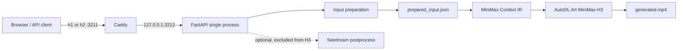
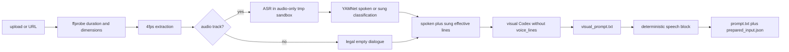
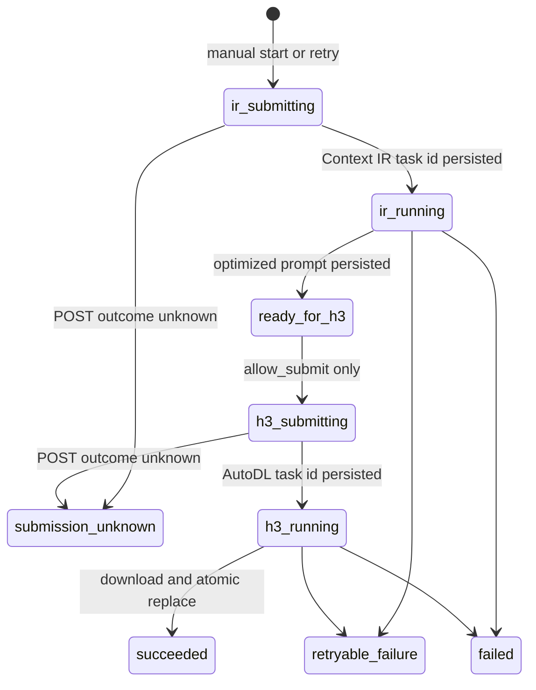

# 架构现状（How/Now）

## 运行边界

生产是单进程 uvicorn，文件系统同时承担会话存储、冻结输入和 H3 恢复日志。公网 Caddy 监听 `:3211`，仅反代到 `127.0.0.1:3212`；H3 是视频模型名，不是 HTTP/3。



## 模块

| 模块 | 职责 | 实现的 feature |
| --- | --- | --- |
| `app/main.py` | API、schema v2/只读门控、提交锁、异步 generation、启动恢复 | conversation-task |
| `app/storage.py` | 会话目录、meta、上传/探测、文件白名单 | conversation-task |
| `app/pipeline.py` | 4fps 抽帧、音频/台词准备、视觉 agent 隔离、初始 receipt | conversation-task |
| `app/prepared_input.py` | 结构化台词、唯一发声块、文件哈希绑定、fail-closed loader | conversation-task |
| `app/frame_fit.py` | 用户确认后把关键帧居中 crop 或黑边 pad 为 9:16 | conversation-task |
| `app/h3.py` | Context IR → H3 的 start/inspect/resume/retry 和磁盘状态机 | conversation-task |
| `app/voice.py` / `app/vocal.py` | 音频抽取、ASR JSON 校验、YAMNet `spoken/sung` 分类 | conversation-task |
| `app/postprocess.py` / `app/seedream.py` | 可选去字幕/品牌关键帧编辑；不参与 H3 输入 | postprocess |
| `app/codex_runner.py` | 本地 codex 内层 workspace 沙箱、voice 专用外层文件系统隔离、并发和超时；不把服务凭据交给 agent | conversation-task |
| `web/` | 同源 UI、2 秒轮询、显式台词/画幅确认和人工重试 | conversation-task |

Seedance 生产提交模块已删除，`face_hold` 选项和机械提示词注入也已删除。旧实现不是部署回退面。

## 输入准备数据流



关键不变量：

- 新会话 `schema_version=2`，有效源时长为 `(0, min(MAX_DURATION_S, 15)]`；新契约只处理单段。
- 自动台词 Codex 不在会话目录运行。后端为每次尝试新建 `/tmp/duet-voice-*`，只复制 `work/voice.mp3` 和仅含 `duration_seconds` 的 `work/manifest.json`；外层 `bwrap` 在内层 `workspace-write`、断网和秘密环境变量清洗之外遮住 checkout、`/tmp` 其余内容及必要时的会话目录。缺少 `bwrap`、stage/work/session 路径异常或 symlink 音频都 fail closed。
- 自动台词的唯一可收养 agent 输出是隔离区 `work/voice_lines.json`：先做大小、普通文件与 JSON 字段白名单校验，再把净化结果写回主 `work/`。重试创建全新隔离区；Codex 超时/非零退出但完整产物已通过同一校验时仍可收养。
- ASR 初次校验和 YAMNet 分类使用 `voice.mp3` 的真实时长；随后、写 `voice_lines/meta/receipt` 前，必须把有效台词归一到 manifest 的视频时间轴。跨越视频结尾的行把 `end_s` 截到视频时长，`start_s >= duration_s` 的 MP3 编码纯尾部行丢弃并留 provenance/warning，归一结果再过一次 voice 白名单。receipt 的时间真相始终是视频时长。
- 视觉 agent 运行时看不到 `voice_lines.json`。视觉 prompt 中的 OCR、字幕、画面文字或备注不会被解析成台词。
- `auto` 只接受内部 ASR provenance；默认声学过滤同时保留 `spoken` 与 `sung`。`edit/custom` 只接受用户提交的结构化行；`none` 必须为空。
- `prompt.txt` 由视觉文本和唯一结构化发声块机械组合。无台词时明确禁止角色说出画面文字。
- Context IR 结果中的全部严格小写 `<d>...</d>` 标签在去掉每段可选 `[Language]` 前缀后，必须与冻结 `voice_texts` 在数量、顺序和文本上全等。少、多、改写、乱序、无标签或残缺标签均在 H3 POST 前失败；空台词时还会拒绝新增台词、角色发声和 OCR 朗读语义。
- `duration_s` 以实际浮点数写 receipt；Context IR/H3 的请求时长为 `ceil(duration_s)`，范围 1–15。
- `fit_required` 只在 pipeline `done` 时按实际选中的每张关键帧计算，不持久化源视频宽高作为第二真相。只有全部关键帧都是 9:16 才允许 `none`，任一非 9:16 就必须人工选 `crop` 或 `pad`；即使源视频是 9:16，裁过的关键帧也不能绕过。两种策略都不缩放帧，只做居中裁切或居中黑边扩画布。
- H3 关键帧只能来自原始 `work/keyframes/` 或 `work/h3_frames/{crop|pad}/`；永不读取 `postprocessed/`。

## 冻结输入

`prepared_input.json` 的 schema 是 `duet.prepared-input` v1，与会话 schema v2 分开版本化。它绑定：

- source、可选 normalized audio、1–9 张有序关键帧、视觉 prompt、最终 prompt 的相对路径与 SHA-256；
- 台词 mode、标准化 lines、provenance、classification 和台词 JSON 哈希；
- `vocal_filter.enabled`、实际 `duration_s`、`ratio=9:16`、`fit_mode`；
- Context IR/H3 的模型、workflow、整数时长和分辨率请求。

写 receipt 后立即经过同一 loader 复核；提交和重启恢复也重新加载。未知 schema/version、路径越界、文件缺失/漂移、台词漂移、最终 prompt 不是确定性组合时全部 fail closed。提交锁内会按用户最终台词和画幅选择重写 receipt，随后 H3Request 只使用当次加载的不可变 bytes。

## H3 付费状态机



`app/h3.py` 在每次供应商 POST 前先持久化 `submitting`，拿到 task id 后再持久化 receipt，最后才轮询。`.h3/` 的安全边界：

- `session.json` 绑定 cid；`session.lock` 使用非阻塞 flock，拒绝同会话并发推进。
- `attempts/000001/attempt.json` 以 0600 创建，后续原子写 + `fsync`；attempt state schema 为 v1。
- input、IR task、H3 task 和最终输出各有 receipt；状态中不保存结果 URL或凭据，只保存安全错误码。
- `start` 以同一 client id 幂等推进；公开 `resume_required` 由用户用同 id、同台词、同 fit 确认后再次调用 `start`，继续同一 receipt/attempt。只有确定 `failed` 才由新 id 调 `retry` 创建 attempt。
- 启动 `resume` 设置 `allow_submit=false`，只对已经持久化的 task 做 GET 查询/下载，不发新的供应商 POST。`ready_for_h3`、已知 task 的查询/超时、下载传输/输出写入故障和 raw running 状态映射为 `resume_required`；`submission_unknown` 一律锁死。
- provider 成片 URL 必须是无 userinfo 的 HTTPS，且 DNS/IP 预解析结果全部为公网地址。下载 client 不读取代理环境；响应到达后在读取 status/body 前，从 httpx network stream 取得实际 socket peer 并再次要求公网地址，从而不把预解析结果当作连接事实。无法解析 DNS、无法验证 peer、ffprobe 缺失/超时属于已有 task 的可恢复故障；预解析或实际 peer 为私网则确定拒绝。
- 下载不跟随重定向。Content-Length 和实际流都限制为 200 MiB，内容先写同目录 0600 临时文件；ffprobe 正常执行并确认存在 video stream 且 format duration 有限并大于 0 后，才原子替换 `generated.mp4` 并 fsync。

API 暴露的 coarse generation 是 `queued/running/resume_required/succeeded/failed/submission_unknown`。四类 provider 查询/超时及 `download_failed/download_dns_failed/download_peer_unverified/output_write_failed/output_probe_failed` 映射为 `resume_required`；URL/实际 peer、重定向、体积、无效视频等确定性安全拒绝映射为 `failed`。服务没有自动付费重试。`submission_unknown` 对任何 id 固定返回 409 `submission_outcome_unknown`；意外 provider 异常会先 inspect，只有磁盘状态明确为确定失败时才开放新 id。

## 数据布局

```text
data/<cid>/
├── meta.json                         # conversation schema v2
├── source.<mp4|mov|webm>
├── prepared_input.json               # duet.prepared-input v1
├── generated.mp4                     # H3 success only
├── .h3/
│   ├── session.json
│   ├── session.lock
│   └── attempts/000001/attempt.json
└── work/
    ├── manifest.json
    ├── voice.mp3                     # optional
    ├── voice_lines.json
    ├── visual_prompt.txt
    ├── prompt.txt
    ├── keyframes/*.png
    ├── h3_frames/{crop|pad}/*.png    # only after explicit fit choice
    └── postprocessed/*.png           # optional display-only Seedream output
```

旧 meta 缺 `schema_version=2` 时，详情派生 `read_only=true`；文件仍可查看，但 `/submit` 和 `/postprocess` 都拒绝修改。

## 并发、恢复与安全

- 上传创建的查重/排队计数在进程锁内；pipeline 使用进程信号量；提交和后处理各有每会话 asyncio 锁。
- H3 远程调用在后台线程中执行，状态先写 meta `queued`，再写 `running`。服务启动仅扫描 schema v2 且 generation 为 `queued/running` 的会话。
- 应用必须单进程运行。内存锁和信号量不跨 worker；不要加 `--workers`。
- 供应商凭据只在 `Settings`/H3Request 内存中；receipt、attempt、meta、API 与安全错误都不含密钥。
- 自动台词依赖宿主 `bwrap` 与 Codex 内层 sandbox 能力；任一不可用都令该准备步骤失败，不退化为仅靠提示词禁止读取视觉输入。
- Caddy 是唯一公网监听；uvicorn 固定 `127.0.0.1:3212`。systemd 使用 0077 umask 和外部 0600 EnvironmentFile。

## 对外接口

- HTTP：`/api/health`、`/api/login`、`/api/conversations*`；完整字段和状态码见 [reference](../reference/reference.md)。
- Python：`prepared_input.write_prepared_input/load_prepared_input`、`h3.start/inspect/resume/retry`、`frame_fit.fit_frames`。
- 部署：[.deploy/runbook.md](../../../.deploy/runbook.md)；systemd 示例不包含凭据。
